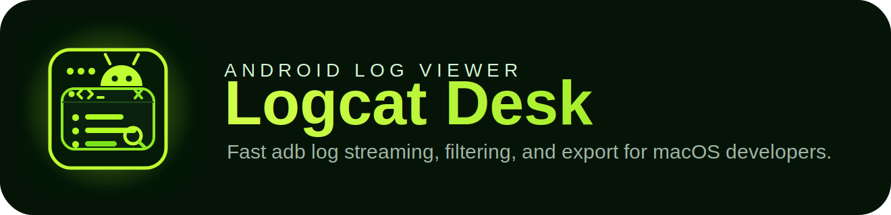

# Logcat Desk


<p align="center">
  
</p>

Logcat Desk is a desktop app for macOS focused on Android developers who want a fast `adb logcat` workflow without opening Android Studio.

## Stack

- Electron
- TypeScript
- React
- Tailwind CSS
- Secure preload + `contextBridge`
- Native `adb` execution through `child_process.spawn`

## MVP included

- Detect connected devices with `adb devices -l`
- Select a device
- Start a real-time `adb -s <deviceId> logcat -v threadtime` session
- Filter logs by free text, tag, package text, and minimum level
- Search-highlight matches in the console
- Pause and resume capture
- Clear the local console view
- Clear the device log buffer with `adb logcat -c`
- Export visible logs to `.txt`
- Export the full captured session to `.log`
- Copy visible logs or single rows to the clipboard
- Persist ADB path, auto-scroll, selected device, and filters

## Project structure

```text
src/
  main/
    ipc/
    services/
      adb/
      export/
      logcat/
      settings/
  preload/
  renderer/
    src/
      components/
      hooks/
      services/
      store/
      utils/
  shared/
```

## Run locally

1. Install dependencies:

```bash
npm install
```

2. Start the development app:

```bash
npm run dev
```

3. Build production assets:

```bash
npm run build
```

4. Package a local macOS app bundle:

```bash
npm run pack:mac
```

5. Create macOS release artifacts (`.zip` + `.dmg`):

```bash
npm run dist:mac
```

## Notes

- The app does not depend on Android Studio at runtime.
- `adb` can be discovered from `PATH`, `ANDROID_HOME`, `ANDROID_SDK_ROOT`, or configured manually in the sidebar.
- Renderer code does not use `nodeIntegration`.
- The main process batches log events before sending them to the renderer to keep the UI responsive.

## GitHub workflows

- `CI`: runs lint, coverage, build, and a macOS packaging smoke check.
- `Prepare Release PR`: opens a release pull request with a version bump and detailed changelog scaffold.
- `Release Drafter`: keeps a categorized draft release in sync from merged PR labels.
- `Release`: builds signed-or-unsigned macOS artifacts on tags like `v0.1.0` and attaches them to a GitHub Release.

## Open source

- Contribution guide: [CONTRIBUTING.md](./CONTRIBUTING.md)
- Code of conduct: [CODE_OF_CONDUCT.md](./CODE_OF_CONDUCT.md)
- Security policy: [SECURITY.md](./SECURITY.md)
- Support guide: [SUPPORT.md](./SUPPORT.md)
- Changelog: [CHANGELOG.md](./CHANGELOG.md)
- Roadmap: [ROADMAP.md](./ROADMAP.md)
- Repository governance: [docs/maintainers/repository-governance.md](./docs/maintainers/repository-governance.md)

## License

This project is released under the [MIT License](./LICENSE).

## Recommended next steps

- Add structured presets for tag/package filters.
- Add multi-device tabs.
- Add log bookmarks and saved sessions.
- Add disk-backed persistence for long-running captures.
- Add package-aware filtering by resolving app PID mappings through ADB.
