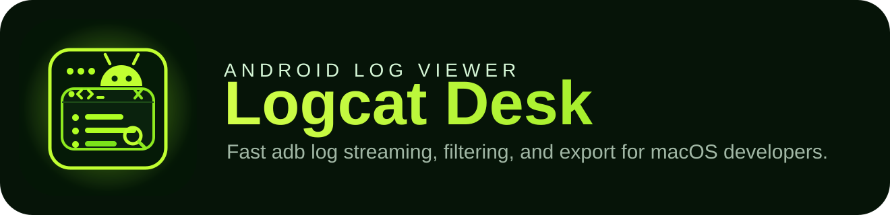
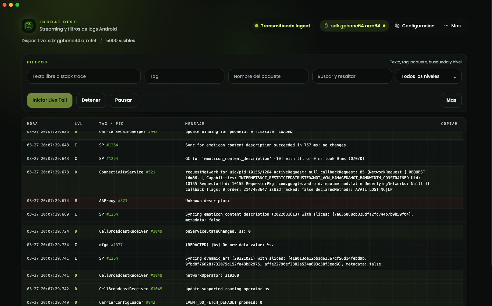
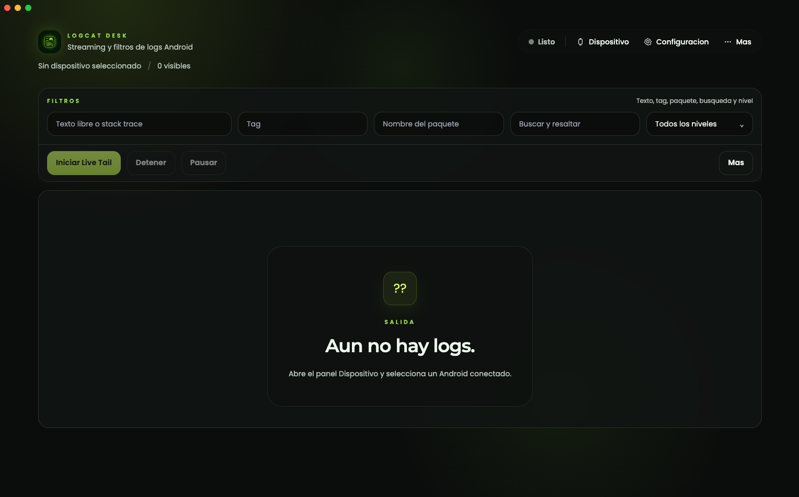

# Logcat Desk


<p align="center">
  
</p>

Logcat Desk is a desktop app for macOS focused on Android developers who want a fast `adb logcat` workflow without opening Android Studio.

## App Preview

### Live log streaming



### Empty state



## Stack

- Electron
- TypeScript
- React
- Tailwind CSS
- Secure preload + `contextBridge`
- Native `adb` execution through `child_process.spawn`

## MVP included

- Detect connected devices with `adb devices -l`
- Select a device
- Start a real-time `adb -s <deviceId> logcat -v threadtime` session
- Filter logs by free text, tag, package text, and minimum level
- Search-highlight matches in the console
- Pause and resume capture
- Clear the local console view
- Clear the device log buffer with `adb logcat -c`
- Export visible logs to `.txt`
- Export the full captured session to `.log`
- Copy visible logs or single rows to the clipboard
- Persist ADB path, auto-scroll, selected device, and filters

## Intelligent analysis and AI keys

See [docs/user/ai-analysis.md](./docs/user/ai-analysis.md) for setup, API key handling, providers, and troubleshooting.

## User documentation

See [docs/user/README.md](./docs/user/README.md) for complete user guides (quick start, workflows, settings, AI, troubleshooting).

## Project structure

```text
src/
  main/
    ipc/
    services/
      adb/
      export/
      logcat/
      settings/
  preload/
  renderer/
    src/
      components/
      hooks/
      services/
      store/
      utils/
  shared/
```

## Run locally

1. Install dependencies:

```bash
npm install
```

2. Start the development app:

```bash
npm run dev
```

3. Build production assets:

```bash
npm run build
```

4. Package a local macOS app bundle:

```bash
npm run pack:mac
```

5. Create macOS release artifacts (`.zip` + `.dmg`):

```bash
npm run dist:mac
```

## Signed macOS distribution (Gatekeeper-friendly)

Logcat Desk uses Electron + `electron-builder` with:

- Developer ID code signing
- Hardened Runtime
- Apple notarization
- Stapled `.dmg` artifacts

This ensures users can install and open the app without manual quarantine removal.

### Requirements

- Active Apple Developer Program membership
- `Developer ID Application` certificate exported as `.p12`
- App-specific password for your Apple ID
- Apple Team ID

### Create the Developer ID certificate

1. Open Keychain Access on macOS.
2. Find your `Developer ID Application` certificate.
3. Export it as `.p12` with a strong password.
4. Convert it to base64 for CI usage:

```bash
base64 -i "Developer ID Application.p12"
```

Use that value in `CSC_LINK`, and the export password in `CSC_KEY_PASSWORD`.

### Create an app-specific password

1. Sign in to [appleid.apple.com](https://appleid.apple.com).
2. Open **Sign-In and Security**.
3. Generate an **App-Specific Password**.
4. Save it in `APPLE_APP_SPECIFIC_PASSWORD`.

Use your Apple ID email for `APPLE_ID` and your Apple Team ID for `APPLE_TEAM_ID`.

### Environment variables (local or CI)

Never hardcode secrets. Provide them through environment variables:

```bash
export CSC_LINK="<base64-p12>"
export CSC_KEY_PASSWORD="<p12-password>"
export APPLE_ID="<apple-id-email>"
export APPLE_APP_SPECIFIC_PASSWORD="<app-specific-password>"
export APPLE_TEAM_ID="<team-id>"
```

### Build signed artifacts

```bash
npm run dist:mac
```

### Verify signing and Gatekeeper acceptance

```bash
codesign --verify --deep --strict --verbose=2 "release/Logcat Desk.app"
spctl --assess --type execute --verbose=4 "release/Logcat Desk.app"
```

If you are testing unsigned local debug builds only, quarantine removal can still be used as a temporary dev-only workaround.

## macOS builds

Official macOS releases are signed and notarized by Florex Labs.

If you build the app locally from source, the generated app may not be signed or notarized, so macOS Gatekeeper may show a warning. This is expected for local/community builds.

## Notes

- The app does not depend on Android Studio at runtime.
- `adb` can be discovered from `PATH`, `ANDROID_HOME`, `ANDROID_SDK_ROOT`, or configured manually in the sidebar.
- Renderer code does not use `nodeIntegration`.
- The main process batches log events before sending them to the renderer to keep the UI responsive.

## GitHub workflows

- `CI`: runs lint, coverage, build, and a macOS packaging smoke check.
- `Pull Request Labeler`: applies labels automatically from changed file paths.
- `Prepare Release PR`: opens a release pull request with a version bump and detailed changelog scaffold.
- `Release`: builds signed-or-unsigned macOS artifacts on tags like `v0.1.0` and attaches them to a GitHub Release.
- `Stale Issues and Pull Requests`: keeps inactive issues and PRs under control.

GitHub-generated release notes are configured through [.github/release.yml](./.github/release.yml).

## Open source

- Contribution guide: [CONTRIBUTING.md](./CONTRIBUTING.md)
- Code of conduct: [CODE_OF_CONDUCT.md](./CODE_OF_CONDUCT.md)
- Security policy: [SECURITY.md](./SECURITY.md)
- Support guide: [SUPPORT.md](./SUPPORT.md)
- Changelog: [CHANGELOG.md](./CHANGELOG.md)
- Roadmap: [ROADMAP.md](./ROADMAP.md)
- User docs: [docs/user/README.md](./docs/user/README.md)
- AI analysis and providers: [docs/user/ai-analysis.md](./docs/user/ai-analysis.md)
- Repository governance: [docs/maintainers/repository-governance.md](./docs/maintainers/repository-governance.md)
- GitHub launch checklist: [docs/maintainers/github-launch-checklist.md](./docs/maintainers/github-launch-checklist.md)
- macOS distribution setup: [docs/maintainers/macos-distribution.md](./docs/maintainers/macos-distribution.md)

## License

This project is released under the [MIT License](./LICENSE).

## Recommended next steps

- Add structured presets for tag/package filters.
- Add multi-device tabs.
- Add log bookmarks and saved sessions.
- Add disk-backed persistence for long-running captures.
- Add package-aware filtering by resolving app PID mappings through ADB.
